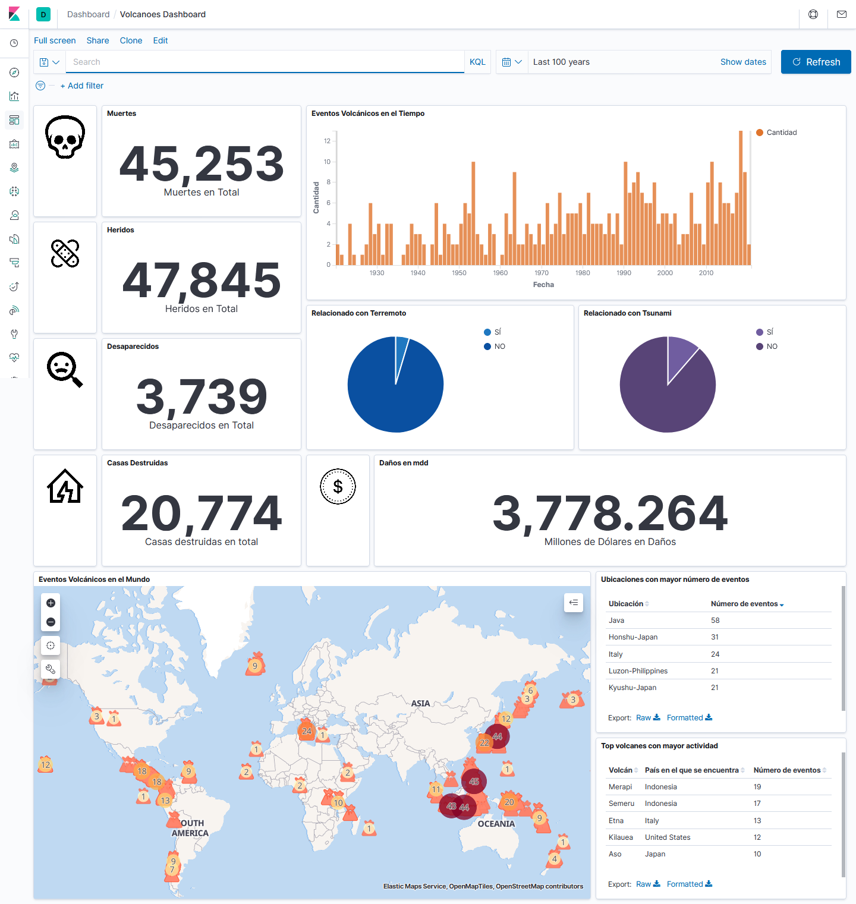
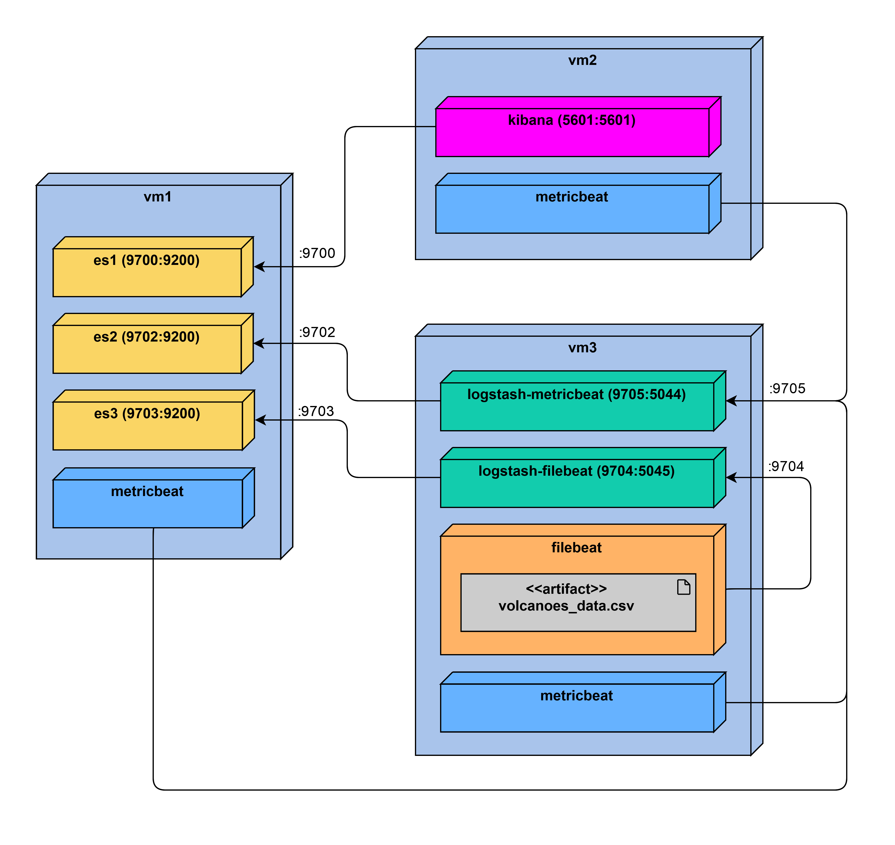

# Volcanic activity dashboard made with the ELK stack

This project consists of the implementation of the ELK stack for the visualization of data on significant volcanic activity in the world.

The information was extracted from the data repository of the United States Department of Homeland Security ([HIFLD](https://hifld-geoplatform.opendata.arcgis.com/datasets/3ed5925b69db4374aec43a054b444214_6/data)).



## Prerequisites

The project is designed to work with three virtual machines connected to a common internal network. We will refer to these machines as **vm1**, **vm2**, and **vm3**. The recommended minimum memory and storage requirements are as follows:

|Machine|RAM    |Storage|
|-------|------:|------:|
|**vm1**|2 GB   |16 GB  |
|**vm2**|1.5 GB |10 GB  |
|**vm3**|1.5 GB |10 GB  |

To lift the system it is necessary to have Docker and Docker Compose installed on each of these machines. Next, the instructions for its installation in Ubuntu Server 18.04 are given, which was the operating system used for development, for other installations consult the documentation of [Docker](https://docs.docker.com/get-docker/) and [Docker Compose](https://docs.docker.com/compose/install/).

**VirtualBox** was used as virtualization software during the development of this project, the use of a different virtualization software may alter the way some configurations are done.

### Docker installation

Update software repositories:
```
sudo apt-get update
```
Download and install Docker:
```
sudo apt install docker.io
```
Start Docker:
```
sudo systemctl start docker
```
Enable the Docker service to start automatically on boot:
```
sudo systemctl enable docker
```
Check the installed version:
```
sudo docker --version
```

### Install Docker Compose

Download Docker Compose (**Note:** version 1.26.1 is being downloaded here, to download the most recent version or any other consult the [documentation](https://docs.docker.com/compose/install/)).
```
sudo curl -L "https://github.com/docker/compose/releases/download/1.26.1/docker-compose-$(uname -s)-$(uname -m)" -o /usr/local/bin/docker-compose
```
Assign execute permission to the binary:
```
sudo chmod +x /usr/local/bin/docker-compose
```
Check the installed version:
```
sudo docker-compose --version
```

## Configuration

Next, the preparation of the infrastructure to run the system is described. This configuration must be done on each of the virtual machines (vm1, vm2 and vm3).

### Virtual machines configuration

These are the steps to follow so that our Ubuntu system runs the ELK stack without problems, this configuration may vary in other operating systems.

#### System configuration

It is necessary to increase the linux kernel parameter `max_map_count` to avoid running out of mapping areas. For this we must add the following line to the file `/etc/sysctl.conf`:
```
vm.max_map_count=262144
```
We reload the configuration:
```
sysctl -p
```
We check the new value:
```
cat /proc/sys/vm/max_map_count
```

We must also configure the memory limits for our user. To do this we edit the file `/etc/security/limits.conf` and add the following lines (**Note:** the user that we have assigned to run the system on all machines is the user **elastic**, in case you have a different username, substitute this username):
```
elastic soft memlock unlimited
elastic hard memlock unlimited
```

To apply the changes we must log in again.

#### Network Configuration

To facilitate the communication between our machines we define hostnames and IPs for each of our machines in the following way:

|Machine|Hostname|IP         |
--------|--------|-----------|
|**vm1**|server1 |192.168.0.3|
|**vm2**|server2 |192.168.0.4|
|**vm3**|server3 |192.168.0.5|

We edit the file `/etc/hosts` and add the following lines in each of the virtual machines:
```
192.168.0.3 server1
192.168.0.4 server2
192.168.0.5 server3
```

We must find out the name of the interface that is connected to our internal network, we can achieve this with the following command:
```
ip address
```

In our case for **vm1** the assigned interface is `enp0s8`.

We edit the network configuration file `/etc/netplan/*.yaml` (in our case `/etc/netplan/50-cloud-init.yaml`) and configure the interface for each of our machines as follows :
<pre>
...
        <b>intranet_interface</b>:
            dhcp4: no
            addresses: [<b>ip_to_assign</b>/24]
...
</pre>

In our case for **vm1** it would be:
<pre>
network:
    ethernets:
        enp0s3:
            dhcp4: true
        <b>enp0s8</b>:
            dhcp4: no
            addresses: [<b>192.168.0.3</b>/24]
    version: 2
</pre>


We apply the configuration:
```
sudo netplan apply
```

## Installation
Next, the installation of the system itself is described, with which the data can be loaded, stored and visualized.

The deployment diagram for this system is as follows:



### Download and copy the necessary files

To get the system to run, you must download the *vm1*, *vm2* and *vm3* directories from this repository. For this you must download the repository, for more information about how to download this repository visit: [How to clone a repository](https://docs.github.com/en/github/creating-cloning-and-archiving-repositories/cloning-a-repository).

The corresponding directory must be saved on each of the machines:

|Machine|Directory|
|-------|----------|
|**vm1**|vm1       |
|**vm2**|vm2       |
|**vm3**|vm3       |

### Initial setup

#### Running Elasticsearch and Kibana

To configure our system it is important that we first run Docker Compose on **vm1** and **vm2** machines, entering the following command in the **vm1** and **vm2** directories respectively:
```
sudo docker-compose up -d
```

We wait a few minutes for Elasticsearch and Kibana to start.

We can check the status of Elasticsearch with the following command in **vm1**:
```
curl -XGET localhost:9700
```

When Elastic is ready we will get a response similar to the following:
```
{
  "name" : "node1",
  "cluster_name" : "uaoelk",
  "cluster_uuid" : "DMBFiCgZSw-6qfupvh3egA",
  "version" : {
    "number" : "7.6.1",
    "build_flavor" : "default",
    "build_type" : "docker",
    "build_hash" : "aa751e09be0a5072e8570670309b1f12348f023b",
    "build_date" : "2020-02-29T00:15:25.529771Z",
    "build_snapshot" : false,
    "lucene_version" : "8.4.0",
    "minimum_wire_compatibility_version" : "6.8.0",
    "minimum_index_compatibility_version" : "6.0.0-beta1"
  },
  "tagline" : "You Know, for Search"
}
```

Once Elasticsearch is up we can check the status of Kibana by executing the following command in **vm2**:
```
curl -XGET localhost:5601
```

In this case when Kibana is ready we will not get a response, if we receive one, for example:
```
curl: (56) Recv failure: Connection reset by peer
```

It means that the server is not ready yet.


#### Login to Kibana

Kibana is running on the **vm2** machine on port 5601. To be able to access it from a browser we can assign the following port forwarding rule in **VirtualBox**:

|Protocol|Host IP  |Host port|Guest IP|Guest port|
|--------|---------|---------|--------|----------|
|TCP     |127.0.0.1|4444     |        |5601      |

This will allow us to access Kibana through the address <http://localhost:4444> from our browser.

#### Configuration of the *volcanoes_data* index

In order for our data to be correctly loaded into Elasticsearch, especially if we want to display our information on the map, we must create the index and configure it with a *geo-point* before running Logstash.

To do this we enter Kibana through the browser and in the menu on the left side we select **Dev Tools**. We write or copy the following query in the console and execute it by hitting the play button:

```
PUT volcanoes_data
{
  "mappings": {
    "properties": {
      "location": {
        "type": "geo_point"
      }
    }
  }
}
```

We can verify that the index has been created by listing our indexes with the following request:
```
GET _cat/indices
```

**Note:** In case we have run Docker Compose on the **vm3** machine before this it is likely that the index has been created without the *geo-dot*, if so, we must recreate it and run Logstash again. To delete the index we execute the following query from Kibana: `DELETE volcanoes_data` in addition to executing the script to clean the filebeat pointer on the **vm3** machine (`./vm3/filebeat/filebeat_data/clean.sh`).

### Start the containers

We must enter to the corresponding **vm\*** directory on each of the machines and execute Docker Compose:
```
sudo docker-compose up -d
```
This will create the following containers:
|Machine|Containers|
|-------|------------|
|**vm1**|es1 <br> es2 <br> es3 <br> metricbeat|
|**vm2**|kibana <br> metricbeat               |
|**vm3**|logstash-metricbeat <br> logstash-filebeat <br> metricbeat <br> filebeat|

If we want to review the logs of a specific container, we must execute the following command on the corresponding machine:
<pre>
sudo docker logs -f <em>container_name</em>
</pre>

To stop following the logs we must press <b>Ctrl + C</b>.

It may take a few minutes to lift and then enter the data into Elasticsearch.

To improve the performance of our ELK stack we can increase the memory that we have assigned to it, for this we can edit the following files:
```
vm1/elastic1_config/jvm.options
vm1/elastic3_config/jvm.options
vm1/elastic2_config/jvm.options

vm3/logstash_metricbeat_config/jvm.options
vm3/logstash_filebeat_config/jvm.options
```
Inside them we edit the parameters `-Xms` and `-Xmx`. Some examples:
```
-Xms256m
-Xmx256m
```
```
-Xms1g
-Xmx1g
```

If we change this setting, we must restart our containers by stopping docker-compose with the command `sudo docker-compose down` and rerunning the command `sudo docker-compose up -d`. It is important that these commands are executed in the **vm\*** directories or one of its subdirectories to function correctly.

### Stop the containers

To stop the execution of our containers we must execute the following command in the directory **vm\*** of each of the machines:
```
sudo docker-compose down
```

### Load the Dashboard

The dashboard is located at `kibana_dashboard/volcanoes_dashboard.ndjson`. We must upload this file to Kibana. For this we must select *Stack Management* in the menu on the left, select *Saved Objects* and finally *Import*. We drag the file `volcanoes_dashboard.ndjson` and click on *Import*. Now we have all the necessary objects to enter and view our data in the Dashboard.

### Visualize the Dashboard

To visualize the Dashboard we enter to Kibana, select **Dashboard** in the menu on the left and select *"Volcanoes Dashboard"*. We select an appropriate period of time (for example: the last 50 years) and recharge. If there is data in the selected period of time, it will show us our visualizations.


The icons that can be seen were taken from [icons8.com](icons8.com).

That's it! Now it only remains to explore the data and, if you wish, you can add more visualizations or modify the existing ones.
